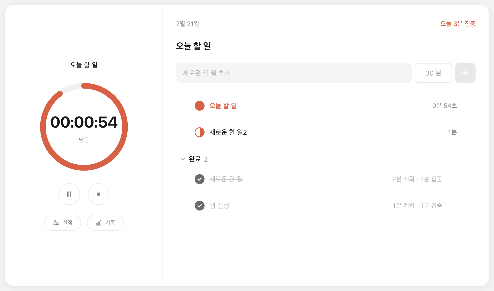
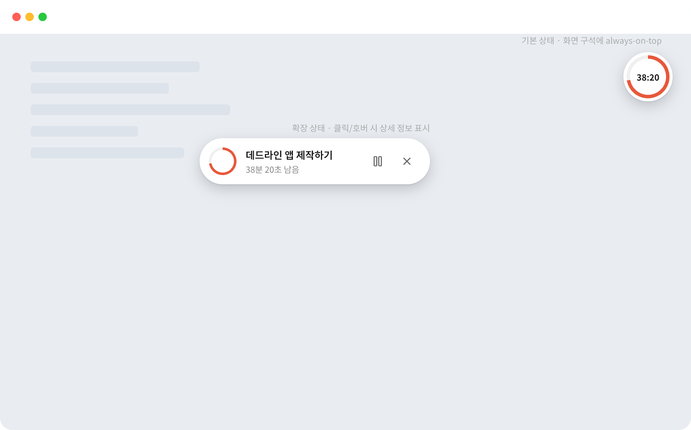

# Deadline Flow (하루집중)

> 마감이 코앞에 와야 움직이는 사람들을 위한 타임박싱 데스크탑 앱

<p align="center">
  
  
</p>

## 소개

**Deadline Flow**는 할 일마다 "이만큼 안에 끝낸다"는 마감 시간을 정해두고, 그 시간을 화면 한쪽에 항상 떠 있는 타이머로 보여주는 집중 앱입니다. 뽀모도로처럼 시간을 딱딱하게 25분씩 끊는 대신, 할 일마다 필요한 만큼 시간을 자유롭게 배분할 수 있습니다.

로그인이나 회원가입이 필요 없고, 인터넷 연결 없이도 동작합니다. 기록은 전부 내 컴퓨터 안에만 저장됩니다.

## 주요 기능

- **할 일 등록 & 마감 설정** — 오늘 할 일을 적고, 각각 몇 분이 걸릴지 정합니다.
- **항상 떠 있는 타이머 위젯** — 다른 창으로 작업을 옮겨도 화면 위에 남아있는 작은 위젯으로 남은 시간을 계속 확인할 수 있습니다.
- **홈 화면 한눈에 보기** — 진행 중인 할 일의 원형 타이머와, 오늘의 할 일 목록을 한 화면에서 관리합니다.
- **휴식 관리** — 할 일 사이사이 원하는 만큼 휴식을 자동으로 넣고, 쉬고 나면 다음 할 일로 바로 이어갑니다.
- **플로우모도로 모드** — 시간이 다 돼도 흐름이 끊기지 않게 이어갈 수 있고, 끝내면 그만큼 보상 휴식을 제안해줍니다.
- **기록 · 통계** — 하루, 한 주 단위로 얼마나 집중했는지 돌아보고, 나에게 잘 맞는 시간대(프라임타임)를 찾아줍니다.

## 이런 분께 추천해요

- 마감이 코앞이어야 비로소 몸이 움직이는 사람
- 뽀모도로처럼 일률적으로 끊기는 것보다, 할 일마다 유동적으로 시간을 쓰고 싶은 사람
- 다른 작업을 하면서도 남은 시간이 계속 눈에 보이길 원하는 사람
- 클라우드에 기록을 남기고 싶지 않은, 로컬 저장을 선호하는 사람

## 설치 방법

macOS와 Windows를 지원합니다. [Releases](../../releases) 페이지에서 내 운영체제에 맞는 파일을 내려받아 설치하세요.

- **macOS** — `.dmg` 파일을 열고 앱을 Applications 폴더로 옮깁니다.
- **Windows** — `.exe` 설치 파일을 실행합니다.

개인이 만든 소규모 배포용 앱이라 별도의 개발자 인증(코드 서명)을 받지 않았습니다. 그래서 처음 실행할 때 운영체제가 "출처를 알 수 없다"는 경고를 띄우는데, 아래처럼 하면 정상적으로 열립니다.

- **macOS**: 앱 아이콘을 더블클릭하는 대신 **우클릭 → 열기**를 누르고, 뜨는 대화상자에서 다시 **열기**를 선택합니다.
- **Windows**: SmartScreen 경고가 뜨면 **추가 정보 → 실행**을 누릅니다.

### 업데이트할 때 (재설치 안내)

새 버전을 받으셨다면 덮어 설치하지 말고 **기존 버전을 먼저 삭제한 뒤** 새로 설치해주세요.

- **Windows**: 설정 → 앱에서 기존 Deadline Flow를 제거한 다음 새 설치 파일을 실행합니다. 그냥 덮어 설치하면 아이콘이 이전 것으로 캐시되어 남아있을 수 있습니다.
- **macOS**: Applications 폴더에서 기존 앱을 휴지통으로 옮긴 뒤 새 dmg로 다시 설치합니다.

서명이 없는 앱이라 버전이 바뀔 때마다 위 우회 경고(우클릭 열기 / SmartScreen)가 다시 뜰 수 있습니다 — 한 번 봤다고 다음 버전에서 안 뜨는 게 아니니 당황하지 않으셔도 됩니다. 드물게 Windows 백신이 처음 보는 실행파일을 오탐해 격리할 수도 있는데, 파일이 설치 직후 사라졌다면 백신의 검역소(격리함)를 먼저 확인해주세요.

## 데이터와 개인정보

- 회원가입, 로그인, 클라우드 동기화가 없습니다.
- 모든 기록은 내 컴퓨터의 로컬 파일에만 저장되고, 외부 서버로 전송되는 데이터가 없습니다.
- 인터넷 연결 없이도 사용할 수 있습니다.

## 개발자용 정보

<details>
<summary>프로젝트 구조 · 개발 환경 실행 · 빌드 방법 (펼쳐보기)</summary>

### 기술 스택

Electron + React(JSX). 데이터는 클라우드 없이 로컬 JSON 파일에만 저장됩니다.

### 프로젝트 구조

- `src/main` — Electron 메인 프로세스. 두 창(메인 창 / 플로팅 위젯)을 생성하고, 하루 세션 상태(`sessionStore`)와 IPC 핸들러, 로컬 JSON 데이터 계층을 갖고 있습니다.
- `src/preload` — `contextBridge`로 렌더러에 `window.api`를 노출합니다.
- `src/renderer` — React UI. `index.html` → 메인 창(`App.jsx`, 홈/기록·통계/설정 탭), `widget.html` → 플로팅 위젯(`WidgetApp.jsx`, 타이머/휴식/다음 태스크 대기/하루 요약 화면).

데이터는 `userData/records/YYYY-MM-DD.json`(날짜별 기록)과 `userData/settings.json`(휴식 시간, 플로우모도로, 알람 소리, 자동 이월 등)에 저장됩니다.

### 개발 모드 실행

```bash
npm install
npm run dev
```

실행하면 메인 창이 열립니다. 홈 화면 우측의 입력줄에서 할 일 이름과 예상 시간(분)을 넣고 추가한 뒤, 목록에서 시작하면 플로팅 위젯(always-on-top)이 뜨면서 카운트다운이 시작됩니다.

- 휴식 길이, 플로우모도로, 알람 소리, 미완료 할 일 자동 이월은 메인 창의 **설정** 탭에서 바꿀 수 있습니다.
- 위젯을 닫으면(X 버튼) 항상 숨김 처리되며, 메뉴바 트레이 아이콘(클릭 시 위젯 다시 열기)으로 언제든 불러올 수 있습니다.

### 빌드

```bash
# macOS (.dmg)
npm run build:mac

# Windows (.exe, NSIS 설치파일)
npm run build:win
```

빌드 산출물은 `dist/`에 생성됩니다. macOS는 Intel+Apple Silicon 겸용 universal dmg, Windows는 x64+arm64 겸용 exe 하나로 생성됩니다. 1차 버전은 코드 서명·공증을 하지 않습니다.

### 구현 범위 / 결정 사항

태스크·마감 설정, 몰입 타이머, 홈 화면, 휴식 관리, 통계·패턴 분석 기능을 구현했습니다. 백색소음 음원, 캐릭터, 클라우드 동기화 등은 포함되어 있지 않습니다.

| 항목 | 결정 |
|---|---|
| 위젯 X 버튼 | 항상 숨기기(트레이로 이동). 종료는 트레이 메뉴에서만 가능 |
| 백색소음 자리 클릭 시 | "준비 중" 안내 토스트 표시 |
| 휴식 종료 후 다음 태스크 | 사용자가 [다음 할 일 시작]을 눌러야 시작 |
| 하루 초기화 시점 | 자정 기준 자동 리셋 |

</details>
